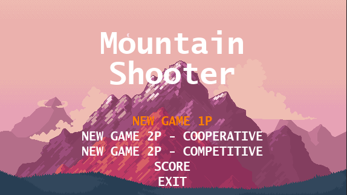
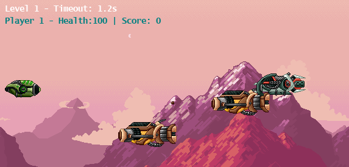
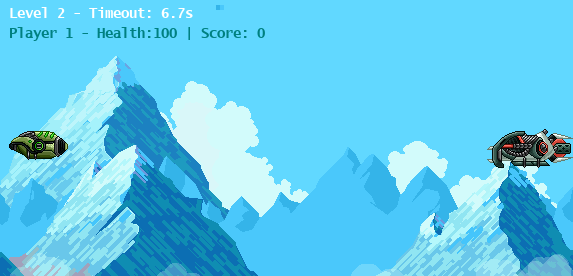

# Mountain Hunter

  

Mountain Hunter is a pixel-art 2D shooter developed with Python and Pygame.  
The game features a parallax scrolling background, multiple gameplay modes, and a persistent high score ranking system.

## 🎮 Gameplay Preview

  
  
  

## Features

- Pixel art graphics
- Parallax scrolling effect
- Multiple game modes (Single Player, Coop, Competitive)
- Player shooting mechanics
- Score saving system
- Top 10 leaderboard
- SQLite database integration

## Technologies

- Python
- Pygame
- SQLite3
- Object-Oriented Programming
- Factory Pattern
- Mediator Pattern
- Proxy Pattern

## How to Run

To run the game, first verify that Python is installed using `python --version`.  
Then clone the repository with `git clone https://github.com/eloiseb1999/MountainHunter.git` and enter the folder using `cd MountainHunter`.  
Install the dependencies with `pip install -r requirements.txt` and run the game with `python main.py`.
